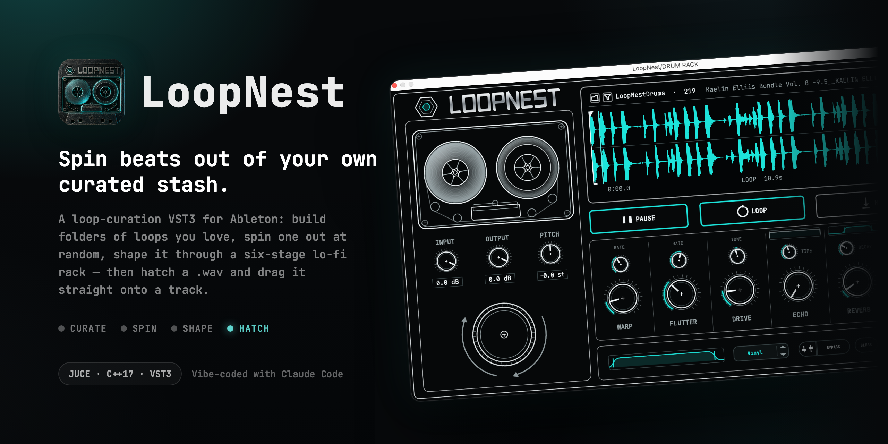
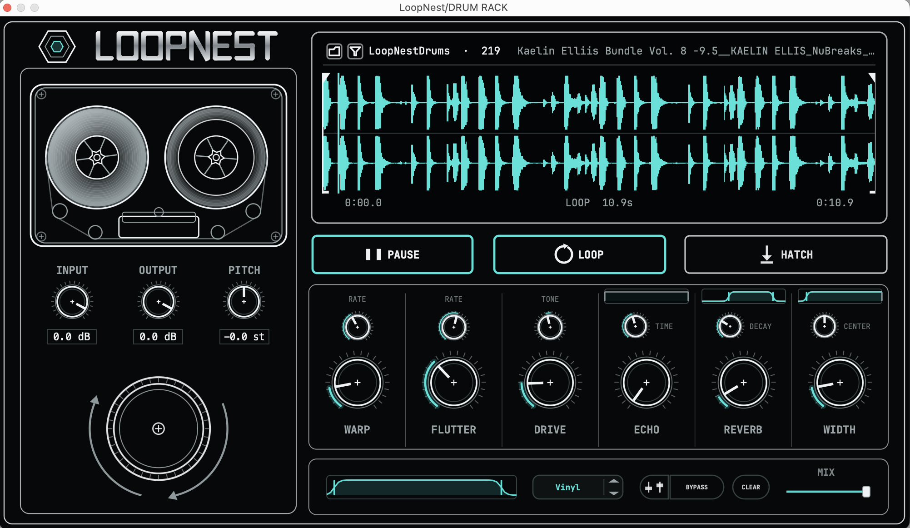

<p align="center">
  
</p>

<p align="center">
  
  
  
  
  
  
</p>

---

LoopNest is a **VST3 + AU** instrument — it loads in just about any modern Mac
DAW (Ableton, Logic, Reaper, Bitwig, and friends). It turns a folder of loops
you love into a beat-making slot machine.

The loop is: **curate → spin → shape → hatch**. Point it at a folder of loops
(it'll even go dig drum grooves out of a sample library for you), hit spin, and
it pulls one out at random. Trim it, pitch it, dirty it up through a six-stage
lo-fi rack until it sounds like *yours* — then **hatch** a `.wav` and drag it
straight onto a track. Chopping and tempo-warping are your DAW's job after the drop.



## What it does

- **Spin** — the big rotor pulls a random loop from your folder. Spin as much
  as you want; the trim handles reset every time.
- **Shape** — pitch it up or down, trim the loop right on the scope, and run it
  through a six-knob character rack: **warp · flutter · drive · echo · reverb ·
  width**. Every knob is clean at zero, so you only ever hear what you dial in.
- **Focus** — tuck each effect into its own slice of the frequency spectrum, add
  a master EQ and a dry/wet mix, and the grit lands exactly where you want it.
- **Presets** — 12 factory looks that only touch the character rack, so your
  pitch, trim, and levels stay put.
- **A/B** — flip back to the untouched loop and level-match on the fly, so you're
  judging the tone and not just the loudness.
- **Hatch** — bounces what you hear, tails and all, to a `.wav`, and the button
  becomes a drag handle straight onto a track in your DAW. Nothing leaves the
  plugin until it sounds right.
- **Curate** — point the funnel at any sample library and it quietly pulls just
  the full drum grooves into a folder for you. Run it again later and it only
  adds the new stuff.

## Requirements

- **A VST3 or AU host on macOS.** Ships in both formats, so it loads in
  **Ableton, Reaper, Bitwig, Cubase** (VST3) and **Logic, GarageBand, MainStage**
  (AU). Built and tested most in Ableton Live 12 + verified in Logic Pro.
- **macOS on Apple Silicon** (arm64). No Windows / Intel build.

## Build

JUCE is referenced as a sibling folder (`../JUCE`), so clone both side by side:

```bash
git clone https://github.com/juce-framework/JUCE.git
git clone https://github.com/andrewmfoster/LoopNest.git
cd LoopNest

cmake -S . -B build -DCMAKE_BUILD_TYPE=Debug
cmake --build build --config Debug
```

The build emits **both** a VST3 and an AU bundle (`FORMATS VST3 AU`). The AU
target needs full **Xcode** installed, not just the command-line tools.

## Install

Install whichever format your DAW uses (or both):

```bash
# VST3 → Ableton, Reaper, Bitwig, Cubase …
rm -rf ~/Library/Audio/Plug-Ins/VST3/LoopNest.vst3
cp -r build/LoopNest_artefacts/Debug/VST3/LoopNest.vst3 ~/Library/Audio/Plug-Ins/VST3/
codesign -s - --deep --force ~/Library/Audio/Plug-Ins/VST3/LoopNest.vst3

# AU → Logic, GarageBand, MainStage
rm -rf ~/Library/Audio/Plug-Ins/Components/LoopNest.component
cp -r build/LoopNest_artefacts/Debug/AU/LoopNest.component ~/Library/Audio/Plug-Ins/Components/
codesign -s - --deep --force ~/Library/Audio/Plug-Ins/Components/LoopNest.component
```

The trailing `codesign` is **not optional**: JUCE writes `moduleinfo.json` into
the VST3 bundle *after* signing it, which leaves a stale signature, and Ableton
silently refuses to load the plugin. Re-sign after every build.

In Logic, the AU is under **Software Instrument → AU Instruments → Wander Foster
→ LoopNest** (restart Logic so it rescans, or run `auval -v aumu LpNs Wndr`).

Two more host quirks, both by design:

- LoopNest declares itself an **instrument with a MIDI input bus** even though
  it ignores MIDI — Ableton refuses to open an instrument VST3 with no event
  input, and it's harmless everywhere else.
- There's no host API for placing clips in a DAW's timeline, so export is
  drag-and-drop of the rendered file off the HATCH key.

## Project layout

```
LoopNest/
├── Source/
│   ├── PluginProcessor.{h,cpp}   — audio engine, plugin state, spin/render
│   ├── PluginEditor.{h,cpp}      — monochrome-blueprint UI
│   └── CharacterChain.h          — the six-stage character DSP, shared by
│                                   audition and render (print-what-you-hear)
├── fonts/                        — bundled JetBrains Mono (OFL)
├── icon/ · screenshots/          — banner + README captures
├── CMakeLists.txt · CLAUDE.md
```

## Aesthetic

Monochrome engineering blueprint: thin white/grey line-art on near-black with a
single teal accent. Type is bundled JetBrains Mono; the wordmark and logo are
hand-drawn vectors (nested hexagons — a nest in a nest).

## License

Released under the [MIT License](LICENSE). © 2026 Andrew Foster.

Bundled JetBrains Mono is licensed separately under the SIL Open Font License.
